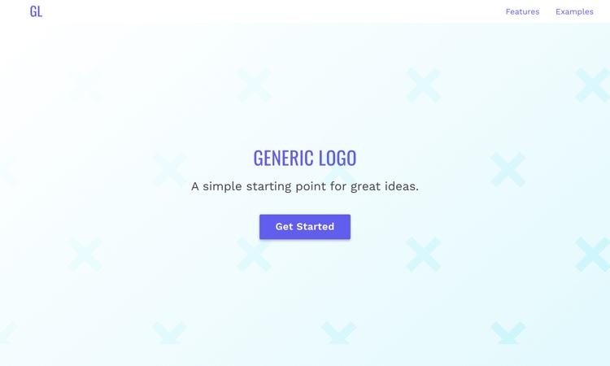

# Generic Logo Theme - v0.1.0

A modern, generic landing page theme for all your projects. 

---- 

## For Development 

1. Open Terminal  
2. Navigate to the project folder  
3. `npm install` installs the dependencies (You only need to do this once)  
5. In your terminal, `gulp` starts the development build process  
6. This process will automatically open the site in your default browser, and begin watching for changes to your files.  
8. Use `gulp build` for production build. The production code will be output into the `/dist` folder

----